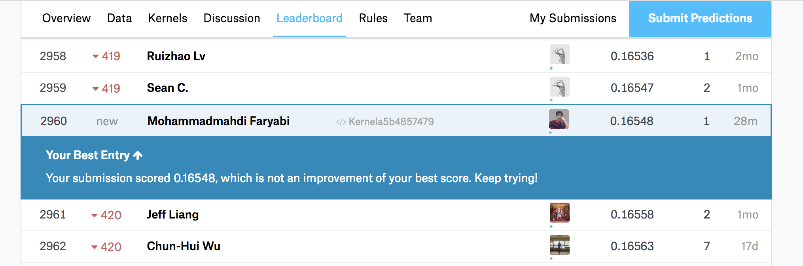

<div align="center">

</div>

> <p dir="RTL"> 
با توجه به داده های قیمت منازل
لطفا با سوالات زیر پاسخ دهید.
</p>

><p>
Loading required libraries and data files:
</p>

```{r Q0, cache=TRUE}
library(readr)
library(dplyr)
library(ggplot2)
library(highcharter)
library(tidyr)

test_data <- read_csv('../../house/test.csv')
train_data <- read_csv('../../house/train.csv')

```

***

<p dir="RTL">
۱. ماتریس همبستگی متغیرهای مختلف را به دست آورده و سپس رسم نمایید.
اعداد به دست آمده را با آزمون فرض معناداری همبستگی بسنجید و سپس ده متغیری که همبستگی بالاتری با قیمت دارند را مشخص نمایید.
</p>

><p>
<br/>
First we've selected only numeric columns for the calculations since using the categorical data in a linear regression model is not suitable.<br/>
Then we've removed the Id column from data since it is a dummy attribute and does'nt relate to our model.<br/>
Then we've calculated pairwire correlation beased on complete observation pairs in dataset and created the correlation matrix.<br/>
<br/>
We are only interested in correlations with SalePrice, so we've selected the 10 most correlated variables with the SalePrice excluding itself (correlation of an RV with itself is 1).<br/>
This data will become useful in the following questions.<br/>
<br/>
<br/>
After that we've visualized correlation matrix in three ways. first is a heatmap visualization. second is another vaiant of heatmap and the third is second visualization augmented with the results of meaningfullness test.<br/>
The confidence level for the conducted test is 95% and the significance level os 2e-16.<br/>
</p>

```{r Q1, cache=TRUE}
################################################################################################
#### Q1

train_data %>% select_if(is.numeric) %>% select(-Id) -> q1_data
q1_data %>% cor(use = "pairwise.complete.obs") -> q1_cor
q1_cor %>% as.data.frame() %>% select(SalePrice) %>% cbind(Factor=rownames(.)) %>%
  arrange(desc(SalePrice)) %>% slice(2:11) -> q1_top_factors


q1_top_factors %>% select(Factor) %>% .$Factor %>% as.character() -> top_factors
q1_top_factors %>% print()
q1_cor %>% hchart()

library(psych)
# q1_data %>% corr.test() %>% .$p %>% print()

library(corrplot)
q1_data %>% cor.mtest(conf.level = .95) -> res1
q1_cor %>% corrplot(type = 'upper')
q1_cor %>% corrplot(type = 'upper', p.mat = res1$p, sig.level = 2e-16, pch.cex = 1.5)

```

***

<p dir="RTL">
۲. در یک تصویر نمودار پراکنش دو به دو ده متغیر بدست آمده به همراه قیمت را رسم نمایید و هم خطی بودن متغیرها را بررسی کنید
</p>
><p>
<br/>
For this question, we've added SalePrice column to the data frame of its 10 most correlated factors and drawn a separate diagram for each pair of the 11 factors.<br/>
The result is 55 distinct diagrams.<br/>
<br/>
<br/>
From the looks of this diagram we can say all of the factors have more or less, some linear like relation with SalePrice.<br/>
Some of the more obvious ones are OverallQual and GrLiveArea and some of the less obvious ones are FullBath and TotRmsAbvGrd.
</p>

```{r Q2, cache=TRUE}
################################################################################################
#### Q2

train_data %>% select(c(top_factors, 'SalePrice')) %>% plot()
```

***

<p dir="RTL">
۳. یک مدل خطی بر اساس ده متغیر برای پیش بینی قیمت برازش دهید. و سپس خلاصه نتایج مدل را به دست آورید.
</p>

><p>
<br/>
We've developed this model using linear regression and the 10 variables we've just found.<br/>
By looking at model's summary we can infer that we cannot reject the null hypothesis that some of the variables in the model are effective. so some of them including 'GarageArea', 'TotRmsAbvGrd' and 'FullBath' may not play a considerable role in our model. <br/>
The model's degree of freedom is 1449 and has a relatively high adjusted R^2 value. showing that The 'linear' modeling probably is not a bad choice.<br/>
The high F Statistics of the model on a relatively large number of data indicates that the hypothesis of all the parameters being zero (except intercept) is rejected.
</p>

```{r Q3, cache=TRUE}
################################################################################################
#### Q3

library(magrittr)

train_data %>% select(c(top_factors, 'SalePrice')) %$% lm(SalePrice ~ ., .) -> q3_lm
q3_lm %>% summary() %>% print()
```

***

<p dir="RTL">
۴. نمودار قیمت واقعی و قیمت پیش بینی را رسم نمایید و خوب بودن مدل را ارزیابی کنید.
</p>

><p>
We've drawn the diagram of predicted prices vs actual prices in a scatter plot.<br/>
In the first glance it looks like there might be a non linear element in the model.<br/>
In order to further analyse the results we've drawn the scatter plot of the residuals vs the actual price.<br/>
This plot shows that the residuals increase as the real price increases. so the model is not that good yet and error variance is not constant across all the price domain.
</p>

```{r Q4, cache=TRUE}
################################################################################################
#### Q4

cbind(
  PredictedPrice = predict.lm(q3_lm, train_data %>% select(c(top_factors))),
  train_data %>% select(SalePrice)
) %>% hchart(type = 'point', hcaes(x = PredictedPrice, y = SalePrice))


cbind(
  Residuals = residuals(q3_lm),
  train_data %>% select(SalePrice)
) %>% hchart(type = 'point', hcaes(y = Residuals, x = SalePrice), color = 'red')

```

***

<p dir="RTL">
۵. مقدار
R-squared
 مدل را به دست آورید. آیا بر اساس این کمیت مدل به خوبی به داده ها برازش داده شده است؟
 کمیت
 F-statistic
 را در خلاصه مدل تفسیر نمایید.
</p>

><p>
The model has a relatively high adjusted R^2 value. showing that The 'linear' modeling probably is not a bad choice and mostly cover's the distribution of data.<br/>
The high F Statistics of the model on a relatively large number of data indicates that the hypothesis of all the parameters being zero (except intercept) is rejected.<br/>
So there is at least one non-zero model parameter.
</p>


```{r Q5, cache=TRUE}
###############################################################################################
#### Q5

# q3_lm %>% summary() %>% print()

q3_lm %>% summary() %>% .$fstatistic
q3_lm %>% summary() %>% .$r.squared
q3_lm %>% summary() %>% .$adj.r.squared
```

***

<p dir="RTL">
۶. بر اساس
p-value
 سطح معناداری ضرایب تصمیم بگیرید که چه متغیرهایی در مدل سازی استفاده شود.
بر اساس متغیرهای جدید دوباره مدل سازی کنید و نتایج رو گزارش دهید.
</p>

><p>
<br/>
Considering the p-value of level of significance of the model parameters we've decided to not use the four less significant valriables in our model.<br/>
These four variable are 'GarageArea', 'TotRmsAbvGrd', 'FullBath' and '1stFlrSF'.<br/>
The reslting model is then summarised and the scatter plots of predicted prices and residuals vs actual prices are drawn.
</p>


```{r Q6, cache=TRUE}
###############################################################################################
#### Q6

train_data %>% select(c(top_factors, 'SalePrice')) %>%
  select(-GarageArea, -TotRmsAbvGrd, -FullBath, -`1stFlrSF`) -> q6_data

q6_data %$% lm(SalePrice ~ ., .) -> q6_lm

q6_lm %>% summary() %>% print()

cbind(
  PredictedPrice = predict.lm(q6_lm, train_data %>% select(c(top_factors))),
  train_data %>% select(SalePrice)
) %>% hchart(type = 'point', hcaes(x = PredictedPrice, y = SalePrice))


cbind(
  Residuals = residuals(q6_lm),
  train_data %>% select(SalePrice)
) %>% hchart(type = 'point', hcaes(y = Residuals, x = SalePrice), color = 'red')

```

***

<p dir="RTL">
۷. مدل خود را بر اساس باقی مانده نقص یابی کنید.
سه محک 
normality, independance, Constant Variance
 را در نقص یابی خود در نظر بگیرید.
</p>

><p>
<br/>
In this question we've improved our model based on the given factors.<br/>
In the question 7 we've seen that the constant error variance assumption across all data range is not quiet right.<br/>
The linear regression model needs this assumption to hold in order to provide accurate results.<br/>
So we've used a logarithemic transformation and move'd the data and model values in the log scales.<br/>
This way the amount of variance and change in the data will be controlled and the model will be more accurate.<br/>
The final model results will be exponented to get the price predictins.<br/>
The prediction and residual diagrams vs real values indicate that our model is far more accurate now.<br/>
<br/>
<br/>
Then we checked our model for multicollinearity with variance inflatin favtors test.<br/>
The small resulting values (smaller than 10 or 5) indicate that probably no multicollinearity and therefore no dependencies are present.<br/>
<br/>
<br/>
At last we've test our model's distribution against a a t student distribution with the same degree of freedom.<br/>
In order to visualize the test results we've used QQ Plot from the car library.<br/>
<br/>
The plot shows that our model is nearly normal in all the t quantiles except for first leftside quantiles where it has more rising slope than the t distribution.
</p>


```{r Q7, cache=TRUE}
###############################################################################################
#### Q7

#### Constant variance

q6_data %>% mutate(SalePriceLog = log(SalePrice)) -> q7_data
lm(SalePriceLog ~ . - SalePrice, q7_data) -> q7_lm

q7_lm %>% summary() %>% print()

cbind(
  PredictedPrice = fitted.values(q7_lm) %>% exp(),
  q7_data %>% select(SalePrice)
) %>% hchart(type = 'point', hcaes(x = PredictedPrice, y = SalePrice))

cbind(
  ((fitted.values(q7_lm) %>% exp()) - (q7_data %>% select(SalePrice))) %>% rename(Residuals = SalePrice),
  q7_data %>% select(SalePrice)
) %>% hchart(type = 'point', hcaes(y = Residuals, x = SalePrice), color = 'red')

#### using VIF for independence test
library(car)
q6_lm %>% vif() %>% print()
#### using qqPlot for normality test
car::qqp(q7_lm, id.method="identify", simulate = TRUE, main="Q-Q Plot")


```

***

<p dir="RTL">
۸. داده ها را به پنج قسمت تقسیم کنید. بر اساس چهار قسمت مدل خطی را بسازید و صحت مدل را برای یک قسمت 
باقی مانده را تست کنید. خطای پیش بینی شما چقدر است؟
</p>


><p>
<br/>
We've used 80% of the data for modeling and the rest for testing the model.<br/>
The diagrams for predictions and residuals vs prices is reported below.<br/>
Average error absolute value is 3422 dollars and the variance is 50000 dollars.<br/>
From the looks of the diagrams we can see that the model is working relatively good!<br/>
</p>


```{r Q8, cache=TRUE}
###############################################################################################
#### Q8

n <- nrow(q7_data)
q8_train_index <- sample(1:n, 0.8*n)
q8_test_index <- setdiff(1:n, q8_train_index)

q8_train_data <- q7_data[q8_train_index,]
q8_test_data <- q7_data[q8_test_index,]

lm(SalePriceLog ~ . - SalePrice, q8_train_data) -> q8_lm


cbind(
  PredictedPrices = predict.lm(q8_lm, q8_test_data) %>% exp(),
  q8_test_data %>% select(SalePrice)
) %>% hchart(type = 'point', hcaes(x = PredictedPrices, y = SalePrice))


cbind(
  ((predict(q8_lm, q8_test_data) %>% exp()) - (q8_test_data %>% select(SalePrice))) %>% rename(Residuals = SalePrice),
  q8_test_data %>% select(SalePrice)
) -> q8_residual_data

q8_residual_data %>% hchart(type = 'point', hcaes(y = Residuals, x = SalePrice), color = 'red')

q8_residual_data_vector <- q8_residual_data %>% select(Residuals) %>% .$Residuals

q8_mu <- mean(q8_residual_data_vector)
q8_sd <- sd(q8_residual_data_vector)

q8_mu %>% print()
q8_sd %>% print()
```

***

<p dir="RTL"> 
۹. آیا قیمت ربط غیر خطی با یکی از ده متغیر استفاده شده دارد؟
بر اساس دستاوردهای خود مدل را بهتر نمایید.
</p>

><p>
<br/>
We've compared the model variables agains one another in order to observe curve similarities to non linear functions.<br/>
<br/>
It looks likely that 'TotalBsmtSF' vs SalePrice is a sqrt-like function and 'GrLivArea' vs SalePrice is a log-like function.<br/>
We think there is no more obvios non linearity evidences.<br/>
<br/>
Then We've recreated the mlodel and used this non linear relations instead:<br/><br/>
[q9_lm <- lm(SalePriceLog ~ OverallQual + I(log(GrLivArea)) + GarageCars + YearRemodAdd + YearBuilt + I(sqrt(TotalBsmtSF)), q7_data)]
<br/><br/>
The final result is better than the previous model and can cover data variance better.<br/>
Average error absolute value is 3000 dollars and the variance is 39000 dollars.<br/>
</p>


```{r Q9, cache=TRUE}
###############################################################################################
#### Q9


# I will compare model variables agains one another in order to 
# observe curve similarities to non linear functions.

q7_data %>% plot()

# 'TotalBsmtSF' vs Sale price is a sqrt-like function and 'GrLivArea' is a log-like function.
# I think there is no more obvios non linearity evidences.

# Now I recreate the mlodel and use this non linear relations instead:

# q7_data[which(q7_data$TotalBsmtSF == 0),]$TotalBsmtSF = 1
q9_lm <- lm(SalePriceLog ~ OverallQual + I(log(GrLivArea)) +
              GarageCars + YearRemodAdd + YearBuilt + I(sqrt(TotalBsmtSF)), q7_data)

q9_lm %>% summary()


cbind(
  PredictedPrices = predict.lm(q9_lm, q8_test_data) %>% exp(),
  q8_test_data %>% select(SalePrice)
) %>% hchart(type = 'point', hcaes(x = PredictedPrices, y = SalePrice))


cbind(
  ((predict(q9_lm, q8_test_data) %>% exp()) - (q8_test_data %>% select(SalePrice))) %>% rename(Residuals = SalePrice),
  q8_test_data %>% select(SalePrice)
) -> q9_residual_data

q9_residual_data %>% hchart(type = 'point', hcaes(y = Residuals, x = SalePrice), color = 'red')

q9_residual_data_vector <- q9_residual_data %>% select(Residuals) %>% .$Residuals

q9_mu <- mean(q9_residual_data_vector)
q9_sd <- sd(q9_residual_data_vector)

q9_mu %>% print()
q9_sd %>% print()
```

***

<p dir="RTL"> 
۱۰. بر اساس مدل نهایی به دست آمده نتایج پیش بینی خود را بر روی
test.csv
به دست آورید و در سایت 
kaggle
 در مسابقه 
 House Prices: Advanced Regression Techniques
بارگذاری نمایید. سپس لینک رتبه و عدد آن را ضمیمه تمرین کنید.
</p>

><p>
<br/>
The kernel is built, and the result submitted.<br/><br/>
The 'Public Score' is 0.16548<br/><br/>
The rank is 2960 out of 4795 at the time of writing this report<br/><br/>
Link to public kernel page:<br/> https://www.kaggle.com/faryabimm/kernela5b4857479/<br/><br/>
Kaggle kernel script file is also included with the report. please look for the file 'HW6_kaggle_version.R'<br/><br/>
</p>

```{r Q10, cache=TRUE}
###############################################################################################
#### Q10

# predict(q9_lm, test_data) %>% exp() %>% View()
```

<div align="center">

</div>
