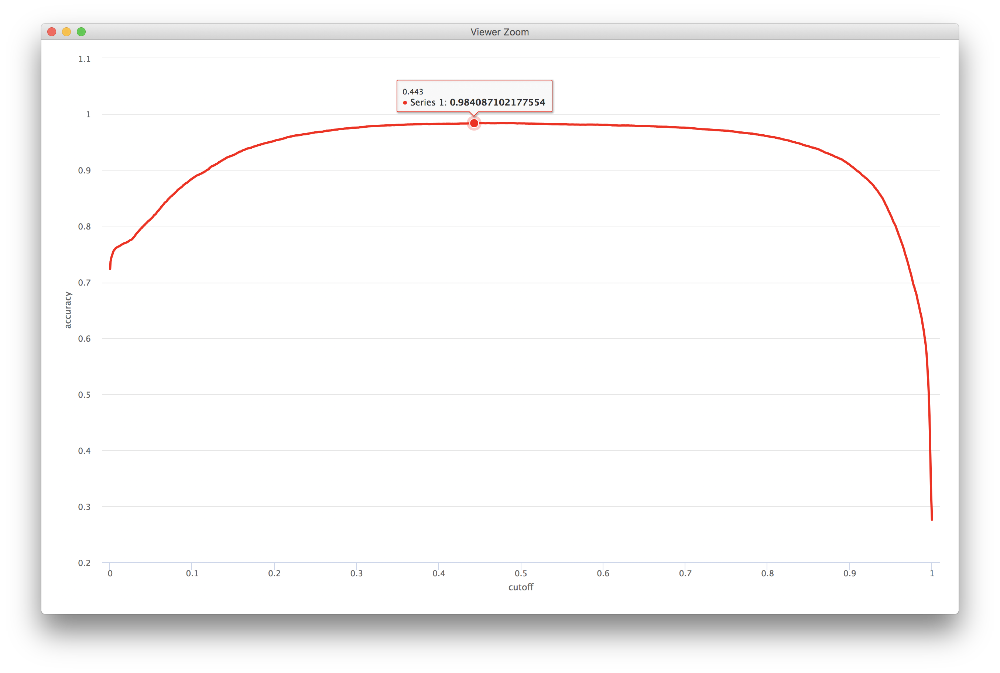
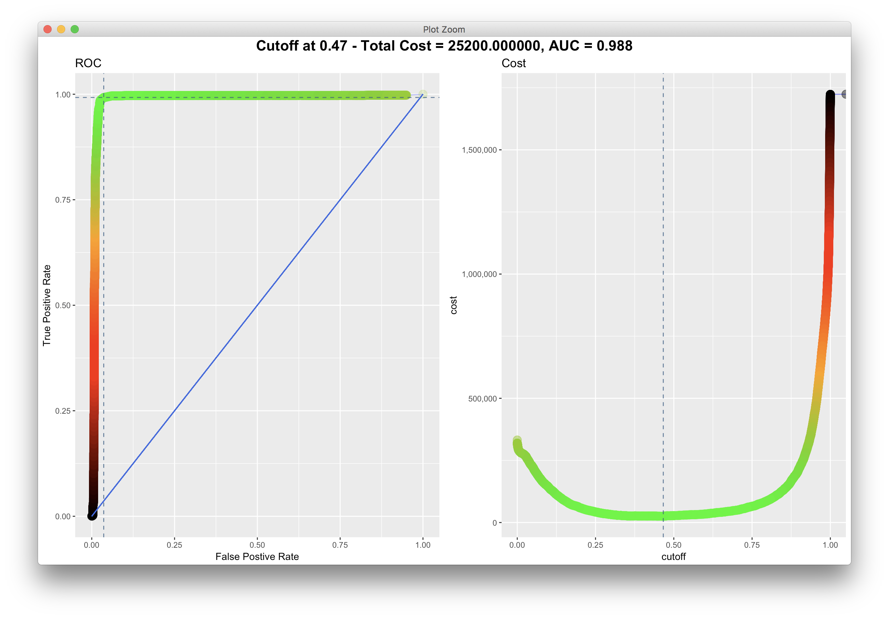
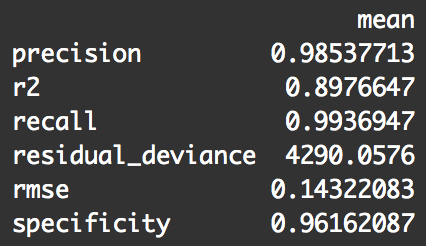

<div align="center">

</div>

><p>
Loading required packages, source files and data.
</p>

```{r Q0, cache=TRUE}
library(readr)
library(dplyr)
library(highcharter)
library(ggplot2)

source('../unbalanced_functions.R')

data <- read_csv('../data/murder_suicide.csv')
```


> <p dir="RTL"> 
با توجه به سوالات مرگ و میر در آمریکا به سوالات زیر پاسخ دهید.
</p>

***

<p dir="RTL">
۱. از میان متغیرهای داده مرگ و میر یک زیرمجموعه ایی بدون حشو در نظر بگیرید.
ماتریس همبستگی متغیرهای مختلف را به دست آورده و سپس رسم نمایید. علاوه بر این نمودار پراکنش متغیرهای انتخاب شده را همزمان نسبت به هم رسم نمایید.
</p>


><p>
<br/>
In order to find a non redundant set of attributes, we started by semantically analysing them and removing the calculated ones, the ones with just a single value, and the ones in which one value was the absolute dominant one.
<br/><br/>
We've also removed the semanticless, artificially added attributes such as Id.<br/>
The result is called non redundant column names.<br/>
<br/>
In order to further minimize the set, we've ommited the attributes with caotic behaviours such as MonthOfDeath and WeekDayOfDeath.<br/>
We've also deleted the attributes with very little absolute correlation to others. such as HispanicOriginRaceRecode.<br/>
The resulting set is called minified non redundant column names.<br/>
<br/>
Then we've drawn three different correlation plots for the resulting data. The third one also has a confidence level analysis built-in.<br/>
<br/>
Finally we've drawn the Distribution diagram for every pair of the 14 remaining attributes.
<p/>

```{r Q1, cache=TRUE}
###############################################################################################
## Q1

data %>% colnames -> colnames
data %>% filter(AgeType == 1) -> data

colnames %>% setdiff(c('EducationReportingFlag', 'AgeType', 'AgeRecode12',
                       'AgeRecode27', 'AgeRecode52', 'InfantAgeRecode22',
                       'RaceImputationFlag', 'RaceRecode3', 'RaceRecode5',
                       'BridgedRaceFlag', 'CurrentDataYear', 'AgeSubstitutionFlag',
                       'CauseRecode358', 'CauseRecode113', 'InfantCauseRecode130',
                       'HispanicOrigin', 'Id')) -> non_redundant_colnames

non_redundant_colnames %>% setdiff(c('HispanicOriginRaceRecode', 'NumberOfEntityAxisConditions',
                                     'NumberOfRecordAxisConditions', 'DayOfWeekOfDeath', 'Race',
                                     'MonthOfDeath', 'PlaceOfDeathAndDecedentsStatus')) -> minified_non_redundant_colnames

data %>% select(non_redundant_colnames) %>%
  mutate_if(is.character, factor) %>% mutate_if(is.factor, as.numeric) -> q1_nr_data

data %>% select(minified_non_redundant_colnames) %>%
  mutate_if(is.character, factor) %>% mutate_if(is.factor, as.numeric) -> minified_q1_nr_data


minified_q1_nr_data %>% cor(use = 'pairwise.complete.obs') -> q1_cor
q1_cor %>% hchart()

library(corrplot)
minified_q1_nr_data %>% cor.mtest(conf.level = .95) -> res1
q1_cor %>% corrplot(type = 'upper')
q1_cor %>% corrplot(type = 'upper', p.mat = res1$p, sig.level = 1e-90, pch.cex = 1.5)

minified_q1_nr_data %>% slice(1:500) %>% plot()
```

***

<p dir="RTL">
۲. اثر هر یک از متغیرهای جنسیت، نژاد،آموزش، سن و نحوه تدفین را بر مرگ یا خودکشی ارزیابی کنید.
</p>

><p>
<br/>
In order to test the Null hypothesis that these variables have no effect on the Manner of Death, we've used the Kruskal-Wallis non parameteric chi-squared test.<br/>
In order to further understand the relations of this variables on the Manner of Death, we've visualized the relations using the proper diagrams.<br/>
<br/>
The results are somewhat interesting!<br/>
<br/>
Firstly the null hypothesis for all of the Sex, Race, Education, Age and MethodOfDisposition variables is confidently rejected.<br/>
<br/>
Here are some interesting atatements:
<ul>
<li>Suicide is more common among women than men; but men are relatively subject to more murders than women.<br/>
Overally suicide is much more common than murder.</li>
<li>We know for a fact that there is no problem with suiciding in the religious beliefs of south westeners of asia. The diagram also is proving this point with high relative value of suicide to murder.<br/>
We can note than the statistics of murder are lower than suicide in all races but the black race!<br/>
The cause is maybe racism acts against black people. Also the high ratio of murder in native american people is considerable.</li>
<li>We can note that the rate of suicide increases with increase in level of education!</li>
<li>As the age increases. the rate of suicide goes up too.<br/>
There is also a high rate of suicide among teenagers enduring the maturity phase.</li>
<li>We can note that the rate of suicide is high amongst nations which burn the body of deceased. We also know for a fact that burining the deceased is common among middle and east asian contries.</li>
</ul>
<p/>

```{r Q2, cache=TRUE}
###############################################################################################
## Q2

# cbind(
#   data %>% select(MethodOfDisposition),
#   data %>% mutate_if(is.character, factor) %>% mutate_if(is.factor, as.numeric) %>% select(MethodOfDisposition)
# ) %>% View()
q1_nr_data %>% mutate(ms = ifelse(MannerOfDeath %in% c(2, 6), 'Suicide',
                                  ifelse(MannerOfDeath == 3, 'Murder', 'Other'))) -> q2_data

############################

male_count <- q2_data %>% filter(Sex == 2) %>% count() %>% as.integer()
female_count <- q2_data %>% filter(Sex != 2) %>% count() %>% as.integer()

q2_data %>% group_by(Sex, ms) %>% summarise(count = n()) %>% ungroup() %>% 
  mutate(Sex = ifelse(Sex == 2, 'Male', 'Female')) %>%
  mutate(ratio = ifelse(Sex == 'Male', count/male_count, count/female_count)) %>% 
  hchart(type = 'column', hcaes(x = ms, y = ratio, group = Sex))

kruskal.test(ms ~ Sex, data = q2_data) %>% print

############################

race_counts <- q2_data %>% group_by(Race) %>% summarise(race_count = n())
race_names <- read_csv('../data/Race.csv')

full_join(
  race_counts,
  race_names %>% rename(Race = Code),
  by = 'Race'
) %>% full_join(
  q2_data,
  by = 'Race'
) %>% group_by(Race, ms, race_count, Description) %>% summarise(count = n()) %>% ungroup() %>%
  mutate(ratio = count/race_count) %>% .[complete.cases(.),] %>% 
  hchart(type = 'column', hcaes(x = Description, y = ratio, group = ms))

kruskal.test(ms ~ Race, data = q2_data) %>% print

############################

q2_data_1989 <- q2_data %>% filter(Education1989Revision != 0)
q2_data_2003 <- q2_data %>% filter(Education2003Revision != 0)


edu_1989_names <- read_csv('../data/Education1989Revision.csv')
edu_1989_names %>% mutate(Description = ifelse(Description == 'Years of elementary school', paste(Code, Description, sep = ' '), Description)) -> edu_1989_names

full_join(
  q2_data %>% group_by(Education1989Revision) %>% summarise(edu_count = n()) %>% filter(Education1989Revision != 0),
  edu_1989_names %>% rename(Education1989Revision = Code),
  by = 'Education1989Revision'
) %>% full_join(
  q2_data_1989,
  by = 'Education1989Revision'
) %>% group_by(Education1989Revision, ms, edu_count, Description) %>% summarise(count = n()) %>% ungroup() %>%
  mutate(ratio = count/edu_count) %>% .[complete.cases(.),] %>% 
  hchart(type = 'column', hcaes(x = Description, y = ratio, group = ms))


kruskal.test(ms ~ Education1989Revision, data = q2_data_1989) %>% print


############################

edu_2003_names <- read_csv('../data/Education2003Revision.csv')

full_join(
  q2_data %>% group_by(Education2003Revision) %>% summarise(edu_count = n()) %>% filter(Education2003Revision != 0),
  edu_2003_names %>% rename(Education2003Revision = Code),
  by = 'Education2003Revision'
) %>% full_join(
  q2_data_2003,
  by = 'Education2003Revision'
) %>% group_by(Education2003Revision, ms, edu_count, Description) %>% summarise(count = n()) %>% ungroup() %>%
  mutate(ratio = count/edu_count) %>% .[complete.cases(.),] %>% 
  hchart(type = 'column', hcaes(x = Description, y = ratio, group = ms))


kruskal.test(ms ~ Education2003Revision, data = q2_data_2003) %>% print

############################

full_join(
  q2_data %>% filter(Age < 250) %>% group_by(Age) %>% summarise(age_count = n()),
  q2_data,
  by = 'Age'
) %>% 
  group_by(Age, ms, age_count) %>% summarise(count = n()) %>% ungroup() %>%
  mutate(ratio = count/age_count) %>% .[complete.cases(.),] %>%
  hchart(type = 'spline', hcaes(x = Age, y = ratio, group = ms))
  
q2_data %>% filter(Age < 250) %>%
  ggplot(aes(y = Age, x = ms)) + geom_boxplot(notch=TRUE, outlier.colour="red", outlier.shape=8)
 

kruskal.test(ms ~ Age, data = q2_data) %>% print

############################

disposition_names <- read_csv('../data/MethodOfDisposition-custom.csv')
disposition_count <- q2_data %>% group_by(MethodOfDisposition) %>% summarise(dispo_count = n())

cbind(
  disposition_names,
  disposition_count
) %>% full_join(
  q2_data,
  by = 'MethodOfDisposition'
) %>% group_by(ms, Description, dispo_count) %>% summarise(count = n()) %>% ungroup() %>% 
  mutate(ratio = count/dispo_count) -> q2_dispo_data

q2_dispo_data %>% hchart(type = 'column', hcaes(x = Description, y = ratio, group = ms))
q2_dispo_data %>% hchart(type = 'column', hcaes(x = Description, y = count, group = ms))

kruskal.test(ms ~ MethodOfDisposition, data = q2_data) %>% print
```

***

<p dir="RTL">
۳. با استفاده از مدل رگرسیون لاجستیک یک مدل به داده ها برازش دهید و سپس آن را نقص یابی کنید.
</p>

><p>
<br/>
Firstly we mutate the MannerOfDeath attribute to be a binary indicator of murder or suicide.<br/>
Then we create our logistic regression model based on the mutated minified data from Q1.<br/>
The analysis of models suggests that the Education1989Revision, InjuryAtWork attributes may have no effect on the MannerOfDeath.<br/>
Using the diagnosis we improve our model, removing these variables from it.<br/>
The analysis of the final model can be found below.
</p>

```{r Q3, cache=TRUE}
###############################################################################################
## Q3

minified_q1_nr_data %>% mutate(MannerOfDeath = MannerOfDeath %in% c(2, 6)) -> q3_data
q3_data %>% filter(Age < 250) -> q3_data

glm(MannerOfDeath~., data = q3_data, family = binomial(link = 'logit')) -> q3_logit_model_1
q3_logit_model_1 %>% summary.glm() %>% print


glm(MannerOfDeath~.-InjuryAtWork-Education1989Revision, data = q3_data, binomial(link = 'logit')) -> q3_logit_model_2
q3_logit_model_2 %>% summary.glm() %>% print
```


***

<p dir="RTL">
۴. با استفاده از سه نمودار خروجی مدل را نسبت به داده واقعی ارزیابی کنید.
</p>

><p>
<br/>
We've analysed model output of the real data using four diagrams.<br/>
The results are followed:<br/>
<p/>

```{r Q4, cache=TRUE}
###############################################################################################
## Q4

q3_data %>% mutate(prediction = fitted(q3_logit_model_2)) %>%
  ggplot(aes(x = Age, y = prediction, color = MannerOfDeath)) + geom_point()


q3_data %>% mutate(prediction = predict(q3_logit_model_2, type = 'response')) %>%
  mutate(MannerOfDeath = as.integer(MannerOfDeath)) %>%
  ggplot(aes(x = Age, y = MannerOfDeath)) + 
  geom_point(aes(x =  Age, y = prediction), color = 'red', alpha = 0.2) + 
  geom_point(alpha = 0.005, size = 3)

library(ggthemes)

q3_data %>% mutate(prediction = predict(q3_logit_model_2, type = 'response')) %>%
  ggplot(aes(fitted(q3_logit_model_2), color = as.factor(MannerOfDeath))) + 
  geom_density(size = 0.5) +
  ggtitle("Training Set's Predicted Score") + 
  scale_color_economist(name = "data", labels = c("negative", "positive"))


table(q3_data$MannerOfDeath,ifelse(fitted(q3_logit_model_2)>0.3,1,0)) %>% plot()
```

***

<p dir="RTL">
۵. ابتدا ۲۰ درصد داده را به صورت تصادفی به عنوان تست در نظر بگیرید. مدل را با استفاده از ۸۰ درصد باقی مانده برازش دهید. با استفاده از پارامتر قطع ۰.۵ نتایج را برای داده تست پیش بینی کنید. سپس کمیت های زیر را محاسبه کنید.
</p>

* P: positive samples
* N: negative samples
* TP: true positive TP (eqv. with hit)
* TN: true negative (eqv. with correct rejection)
* FP: false positive (eqv. with false alarm, Type I error)
* FN: false negative (eqv. with miss, Type II error)
* Accuracy (ACC) ACC = (TP+TN)/(P+T)
* False positive rate (FPR): 1- TN/N
* True positive rate (TPR): TP/P

<p dir="RTL">
مشابه آنچه در کلاس گفته شد نمایشی از  چهار کمیت 
TN, TP,FP,FN
به همراه داده ها رسم نمایید.
</p>

><p>
<br/>
Firstly, the data is randomly devided into a 20% testing data set and a 80% modeling dataset. Then the model is trained using the training dataset and requested statistics are calculated for the model.<br/>
Then the musaic plot is drawn to show the model accuracy and type I and II errors.<br/>
Then the confusion matrix plot is drawn. It's somewhat based on the same idea as the mosaic plot.<br/>
After that the diagram of training/test accuracy is drawn for different cutoffs in two different levels of magnification.
</p>

```{r Q5, cache=TRUE}
###############################################################################################
## Q5
q3_data %>% nrow -> n_data
q5_sample <- sample(1:n_data, size = 0.8*n_data, replace = FALSE)

q3_data %>% mutate(MannerOfDeath = as.integer(MannerOfDeath)) %>% select(-Education1989Revision,-InjuryAtWork) -> q5_data


q4_model_data <- q5_data %>% .[q5_sample,]
q4_test_data <- q5_data %>% .[-q5_sample,]

glm(MannerOfDeath~., data = q4_model_data, family = 'binomial') -> q4_logit_model
q4_test_data$prediction   <- predict.glm(q4_logit_model, newdata = q4_test_data  , type = "response")
q4_model_data$prediction  <- predict.glm(q4_logit_model, newdata = q4_model_data , type = "response")
q4_logit_model %>% summary.glm()

# suicide is TRUE, murder is FALSE

q4_test_data %>% mutate(prediction = predict.glm(q4_logit_model,q4_test_data ,type = 'response')) %>%
  select(prediction, MannerOfDeath) %>% mutate(prediction_end = prediction > 0.5) -> q4_calc_data

q4_calc_data %>% summarise(P = sum(prediction_end),
                           N = n() -  sum(prediction_end),
                           TP = sum(prediction_end & MannerOfDeath),
                           TN = sum(!prediction_end & !MannerOfDeath),
                           FP = sum(prediction_end & !MannerOfDeath),
                           FN = sum(!prediction_end & MannerOfDeath)) %>% 
  mutate(ACC = (TP+TN)/(P+N),
         FPR = 1- (TN/N),
         TPR = TP/P) %>% print

table(q4_test_data$MannerOfDeath, ifelse(predict.glm(q4_logit_model, q4_test_data, type = 'response')>0.5,1,0)) %>%
  plot()

cm_info <- ConfusionMatrixInfo(data = q4_test_data, predict = "prediction",actual = "MannerOfDeath", cutoff = .5 )
cm_info$plot


accuracy_info <- AccuracyCutoffInfo(train = q4_model_data, test = q4_test_data, predict = "prediction", actual = "MannerOfDeath")
accuracy_info$plot

calculate_acc <- function(data, cutoff) {
  P <- sum(data$prediction > cutoff)
  N <- sum(data$prediction <= cutoff)
  TP <- sum((data$prediction > cutoff) & (data$MannerOfDeath == 1))
  TN <- sum(!(data$prediction > cutoff) & !(data$MannerOfDeath == 1))
  
  ACC <- (TP+TN)/(P + N)
  
  return(ACC)
}
draw_acc_diag <- function(gaps) {
  sapply(seq(0, 1, gaps), function(x) {calculate_acc(q4_test_data, x)}) -> all_test_acc_vals
  sapply(seq(0, 1, gaps), function(x) {calculate_acc(q4_model_data, x)}) -> all_model_acc_vals
  rbind(
    cbind(
      seq(0, 1, gaps) %>% as.data.frame %>% rename(cutoff = '.'),
      accuracy = all_test_acc_vals,
      data = 'test'
    )
    ,
    cbind(
      seq(0, 1, gaps) %>% as.data.frame %>% rename(cutoff = '.'),
      accuracy = all_model_acc_vals,
      data = 'train'
    )
  ) %>% hchart(type = 'line', hcaes(x = cutoff, y = accuracy, group = data))
}

draw_acc_diag(0.005)
```

***

<p dir="RTL">
۶. نمودار صحت مدل (accuracy) را بر حسب مقادیر مختلف قطع برای داده تست رسم نمایید. کدام پارامتر قطع بالاترین صحت را در پیش بینی داراست؟
</p>

><p>
<br/>
The diagram was the last diagram of the previous question! :D<br/>
based on the diagram the best cutoff value is about 0.443.<br/>
</p>

```{r Q6, cache=TRUE}
###############################################################################################
## Q6

# draw_acc_diag(0.0005)
```

<div align="center">

</div>

***

<p dir="RTL">
۷. نمودار 
ROC
 را برای داده های قسمت قبل رسم نمایید. همچنین نقطه مربوط به بهترین پارامتر قطع را مشخص نمایید.
</p>

><p>
<br/>
The ROC diagram is drawn and can be found bellow.<br/>
based on this diagram, the best cutoff value is also about 0.443.<br/>
</p>

```{r Q7, cache=TRUE, eval=FALSE}
###############################################################################################
## Q7

cost_fp = 100
cost_fn = 200
roc_info = ROCInfo(data = cm_info$data, predict = "predict", 
                    actual = "actual", cost.fp = cost_fp, cost.fn = cost_fn)
grid.draw(roc_info$plot)
```

<div align="center">

</div>

***

<p dir="RTL">
۸. با قرار دادن کمیت 
nfolds = 5
و با استفاده از 
H20
مدل مساله را بسازید و نتیجه حاصل را ارزیابی کنید.
</p>

><p>
In order to use h2o package for creating the generalized linear regression model, we've first reformatted the data to be compatible with the package.<br/>
Then using h2o.glm model we've created the model.<br/>
statistics of the model show extreme accuracy!
<div align="center">

</div>
</p>

```{r Q8, cache=TRUE}
###############################################################################################
## Q8

library(h2o)

h2o.init()

q8_data <- as.h2o(q5_data)

h2o_model <- h2o.glm(y = "MannerOfDeath", x= colnames(q8_data),
                training_frame = q8_data, family="binomial" ,nfolds = 5)

h2o_model %>% print
```

***

<p dir="RTL"> 
۹. آیا ما میتوانیم سرویسی به قضات ارایه کنیم تا با استفاده از اطلاعات مرگ بتوانند موارد مشکوک به قتل را از خودکشی تفکیک دهند؟
</p>

><p>
<br/>
The model we've developed in this homework has very high accuracy and very low error rate.<br/>
The high R^2 value indicates that the model is well describing the data distribution.<br/>
also the accuracy vs cutoff diagram suggests that we have not performed an overfiting act in training this model.<br/>
<br/>
So based on this information, I think that this model is a powerful model to be used in even in law courts.<br/>
</p>

